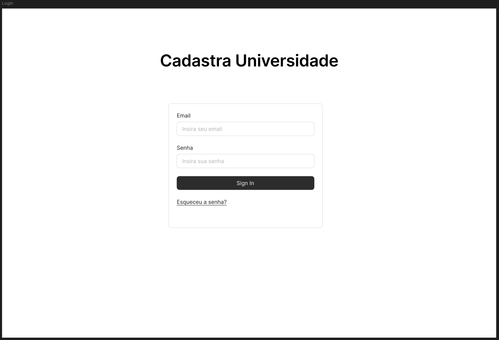

# Cadastra Universidade

- Este repositório armazena a prototipação do sistema de cadastros de uma universidade, desenvolvido para a disciplina de Projeto integrador do terceiro semestre do curso de Análise e Desenvolvimento de Sistemas do Centro Universitário SENAC.

- Futuramente, é intenção dos mantenedores do projeto, desenvolver a aplicação Backend que execute as operações CRUD para as classes Aluno, Professor, Fornecedor, Pessoa Física e Pessoa Jurídica, permitindo que haja persistência nos dados através de um banco relacional SQL.

## Funcionalidades do Sistema
- O Cadastra Universidade tem como objetivo possibilitar o Cadastro e gerenciamento de Alunos, Professores e Fornecedores. 

- Alunos podem somente ser cadastrados como Pessoa Física. Professores e Fornecedores podem ser ou Pessoa Física, ou Pessoa Jurídica.

## Diagrama de Casos de Uso

- O cadastro de usuário é uma funcionalidade acessível e executada apenas por usuários que possuem a alcunha de Administrador do sistema. Usuário Administrador poderá cadastrar usuários dos tipos: Aluno, Professor e Prestador. 

- Ao cadastrar um usuário do tipo Aluno, automaticamente será cadastrado um registro de Pessoa Física.

- Ao cadastrar usuário do tipo Professor ou Prestador, o usuário Administrador deverá selecionar qual tipo de pessoa será cadastrada: Física ou Jurídica. 

- Ao selecionar o tipo Pessoa Física, os campos de dados exigidos para cadastro serão referentes ao registro de Pessoa Física, além dos campos específicos para Professor ou Prestador. 

- Ao selecionar o tipo Pessoa Jurídica, os campos de dados exigidos para cadastro serão referentes ao registro de Pessoa Jurídica, além dos campos específicos para Professor ou prestador.

## Diagrama de Classes

## Documentação UML Completa
[Arquivo-Entrega1](docs/files/Projeto-Integrador-3oSementreI.pdf)

---

## Prototipagem
- Todo o protótipo pode ser visualizado no Figma: [Figma-Protótipo](https://www.figma.com/design/blMmzO6lK5SwxrYyWzHvRP/Projeto-Integrador---Prot%C3%B3tipos?node-id=0-1&node-type=canvas&t=2UlZLAXlQXdtRlHf-0)

### Protótipo - Página Login (Pré-condição)

### Protótipo - Página Gerencimaneto de Usuários (Pré-condição)

### Protótipo - Página Seleção de Categoria

### Protótipo - Página Seleção de Tipo de Pessoa

### Protótipo - Página Formulário - Aluno

### Protótipo - Página Formulário - Professor Pessoa Física

### Protótipo - Página Formulário - Professor Pessoa Jurídica

### Protótipo - Página Formulário - Fornecedor Pessoa Física

### Protótipo - Página Formulário - Fornecedor Pessoa Jurídica

### Protótipo - Sucesso - Opções (Pós-condição)
